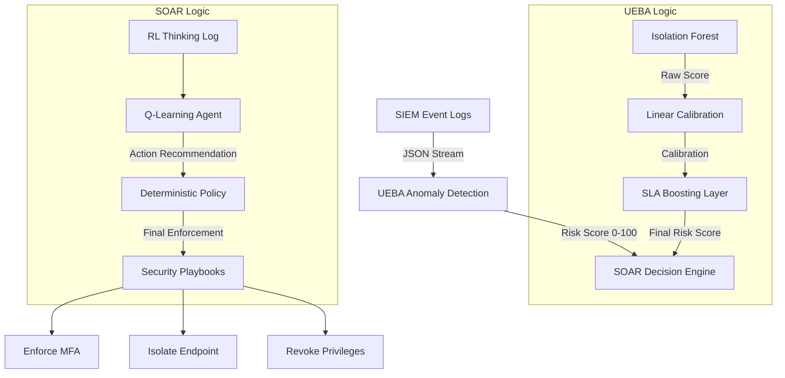

# 🛡️ ZenGuard Master Documentation

Welcome to the **ZenGuard Framework**, a modular Zero-Trust security solution that bridges the gap between raw SIEM data and automated response via Machine Learning and Reinforcement Learning.

---

## 🗺️ System Architecture

ZenGuard follows an **API-First, Vendor-Neutral** architecture designed to process telemetry in real-time.



---

## 🧠 UEBA: The Intelligence Layer
The User and Entity Behavior Analytics (UEBA) module is responsible for identifying "unseen" threats that static rules miss.

### Core Model: Isolation Forest
We use the **Isolation Forest** algorithm because it excels at anomaly detection in high-dimensional security data without requiring labeled "attack" samples.
- **n_estimators**: 100
- **contamination**: 0.05 (Assumes 5% of traffic is anomalous)

### Risk Calibration & SLA Boosting
To ensure that security SLAs are met, the model uses a two-stage scoring process:
1.  **Linear Normalization**: Maps the complex decision function output to a human-readable 0-100 scale.
2.  **SLA Boosting**: Critical security indicators (like MFA Bypass) are automatically "pushed" into the relevant risk band to guarantee immediate response.

---

## ⚡ SOAR: The Enforcement Layer
The Security Orchestration, Automation, and Response (SOAR) module converts risk scores into surgical actions.

### 1. Deterministic Security Policy
ZenGuard enforces a strict policy to guarantee compliance with security SLAs:

| Risk Band | Risk Score | Expected SOAR Response |
| :--- | :--- | :--- |
| **LOW** | 0 – 49 | No automated action needed. |
| **MEDIUM** | 50 – 74 | **Enforce MFA** |
| **HIGH** | 75 – 94 | **Enforce MFA + Isolate Endpoint** |
| **CRITICAL**| 95 – 100| **Enforce MFA + Isolate + Revoke Privileges** |

### 2. Reinforcement Learning (Q-Learning)
The system uses a **Q-Learning Agent** to optimize decision-making. The agent learns from rewards during training:
- **States**: (Risk Band, MFA Bypass Context, Anomaly Flag)
- **Actions**: 0-6 discrete combinations of playbooks.
- **Rewards**: Positive for accurate low-risk passes and high-risk captures; negative for over-responses or missing critical threats.

### 3. Transparency: RL Thinking Log
Analyst observability is critical. Every decision generates an **RL Thinking Log** that reveals:
- The exact **Q-Values** learned for every possible action.
- Whether the RL choice matched or was **overridden** by the deterministic policy.
- A natural-language trace of the evaluation.

---

## 📋 Operational Guide

### 🧱 Setup Sequence
Follow these steps to initialize and verify the system:

1.  **UEBA Setup**: Ensure `UEBA/implementation result/zenguard_ueba_model.pkl` is present.
2.  **Agent Training**:
    ```bash
    cd SOAR
    python train_rl_agent.py
    ```
3.  **Automated Verification**:
    ```bash
    cd Integration
    python test_scenarios_runner.py
    ```
    *All 4 scenarios must return **PASS**.*

4.  **Transparency Check**:
    ```bash
    cd Integration
    python test_rl_thinking.py
    ```
    *Review the RL trace for Decision Transparency.*

5.  **Dashboard Launch**:
    ```bash
    cd Integration
    streamlit run dashboard.py
    ```

---

## 📄 Source Material & Technical Wiki
For further deep dives, refer to:
- **[Onboarding Wiki](file:///d:/zenGUARD/ZenGaurd---implementation/Implemetations/UEBA/README.md)**: Conceptual mapping for new security engineers.
- **[Manual Verification Guide](file:///d:/zenGUARD/ZenGaurd---implementation/Implemetations/Integration/manual_verification_guide.md)**: Ready-to-use SIEM payloads for dashboard testing.
- **CICIDS2017 Dataset**: The foundational data used for behavioral profiling (accessed via `kagglehub`).

---

> [!IMPORTANT]
> **ZenGuard** is designed for extensibility. The modular separation of UEBA and SOAR allows you to swap the Anomaly Model or refine the Playbooks without rewriting the core integration logic.
