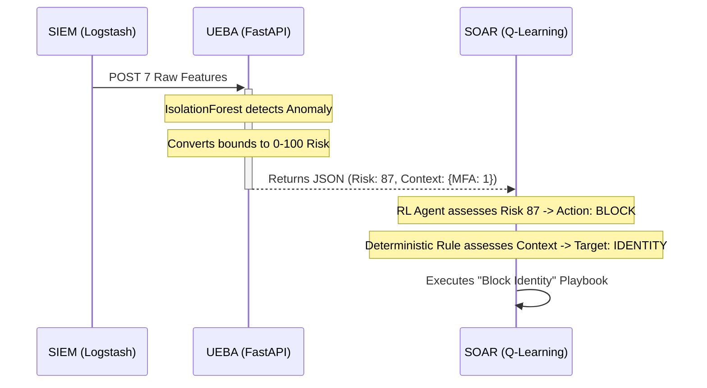

# Zero-Trust Pipeline: SOAR Integration Handoff

Welcome to the **Security Orchestration, Automation, and Response (SOAR)** module. 
This document serves as your master handoff from the SIEM and UEBA teams. It provides the exact context of what has been built upstream, so you know strictly what to rely on and what your integration goal is.

---

## 1. The Core Architecture (Role Analogies)

Unlike generic monolithic applications, our pipeline runs on a "Zero Trust" isolated microservice architecture. Think of the system in three parts:

### 📹 1. SIEM (The Security Cameras)
* **What they did:** The SIEM developer built data pipelines (`logstash` and `zenguard_replayer.py`) that ingest huge amounts of complex network traffic from generic CSV files.
* **What to know:** They dropped all the useless math features and engineered exactly 7 core "Identity" features (`failed_logins`, `MFA_bypassed`, `privilege_change_attempted`, etc.). They push this data perfectly over HTTP. They never talk to you.

### 🧠 2. UEBA (The Behavioral Profiler)
* **What we did:** We took the 7 features the SIEM generated and trained an Unsupervised Machine Learning model (`IsolationForest`) on it offline. We built a FastAPI inference server (`model_server.py`) that constantly runs on `http://127.0.0.1:8000`.
* **What to know:** You will interact *exclusively* with the UEBA API. 

### 🛡️ 3. SOAR (The Armed Guards) - **[YOUR ROLE]**
* **Your Job:** You are responsible for **mitigation**. You do not calculate math. You do not parse network packets. You rely entirely on the UEBA to tell you if an entity is risky, and then you fire the required defensive script.

---

## 2. Upstream Context: How UEBA Passes Data to You

We (the UEBA team) built a dedicated bridge endpoint just for you to consume: `POST /api/soar/evaluate`.

When you (the SOAR) poll this endpoint or receive data from it, you get a JSON payload containing two critical things:

#### A. The Risk Score (For your Q-Learning Table)
The UEBA generates weird float bounds (like `-0.42`). You can't use that easily in your RL `agent.py`. So, we mathematically translated it into a strict **0-100 integer `risk_score`**. 
*You should map your RL State Space directly to this 0-100 vector.*

#### B. The Feature Context (For your Deterministic Engine)
A score of `100` tells you to shoot, but it doesn't tell you *what* to shoot. 
To fix this, we "piggyback" the exact SIEM trigger data back to you securely inside the JSON:
```json
{
  "risk_score": 100,
  "feature_context": {
    "MFA_bypassed": 1,
    "privilege_change_attempted": 0
  }
}
```

---

## 3. Your Integration Tasks (What You Must Do Next)

Now that the endpoints are live, you need to execute the following within the `Implemetations/SOAR/` codebase:

1. **Modify `engine.py` API Hooks:** 
   Update your engine logic to natively request and parse JSON from `http://127.0.0.1:8000/api/soar/evaluate`.
2. **Build Deterministic Fallbacks:** 
   Write strict `if/else` Python rules that look at the `feature_context`. (e.g. `If MFA_bypassed == 1, Execute Playbook: Revoke_Tokens`).
3. **Train the RL Agent (`rl_agent.py`):** 
   Update the Q-Learning parameters so your RL Agent learns that a `risk_score` of 95 requires a 'High Severity' action block, rather than using old mock data.

---

## 4. Interaction Diagram


