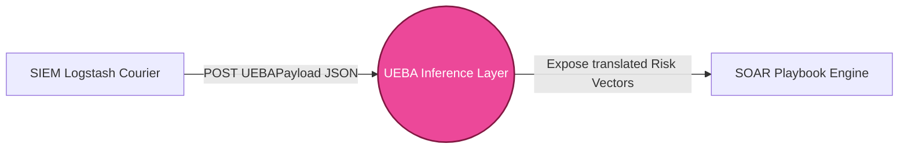

# UEBA V2 Module: Developer Guide & Architecture

**Role Analogy:** *The Behavioral Profiler*

## Overview
The User and Entity Behavior Analytics (UEBA) module serves as the primary intelligence bridge between raw SIEM data and autonomous SOAR playbooks. It ingests targeted identity structures (e.g., failed logins, MFA status), evaluates them entirely offline using an unsupervised `IsolationForest`, and exposes endpoints that translate abstract bounds into universally consumable integers for downstream components.

---

## How To Use This Module

### Prerequisites
Ensure your environment is set up properly for ML processes:
```bash
cd implementations/UEBA_V2/
pip install -r requirements.txt
```

### Running the Offline Pipeline
If you are iterating on the data structures or have sourced new raw network files from the SIEM:
1. **Generate the Dataset:** Run `python generate_dataset.py`. This streams the huge raw capture files and natively condenses 80 columns down into 7 structural identity features tracking to an extremely small `ueba_dataset.csv`.
2. **Train the Model:** Run `python train.py`. This reads your CSV, conducts a robust 70/30 Test split, formats the `IsolationForest` weights, and saves pure `model.joblib` and `scaler.joblib` binaries to disks.
3. **Run Validations:** Execute `python test_unit.py` at any time to offline score a fresh 30% holdout split and immediately print the F1 Anomaly Score metrics.

### Running the Live Inference Server
When you are ready to allow the SOAR pipeline to begin gathering intelligence:
```bash
uvicorn model_server:app --host 0.0.0.0 --port 8000
```
This mounts the `joblib` artifacts directly into a REST API framework instantly accessible by any local system decoupled from data science tools.

---

## C4 Architecture Diagrams

### 1. Context Diagram
This highlights exactly where this module sits inside the Zero Trust Pipeline.



### 2. Component Diagram
This expands exclusively on *our* internal codebase, explaining how the static ML models communicate with the fast inference server.

```mermaid
graph TD
    classDef script fill:#f3f4f6,stroke:#6b7280;
    classDef model fill:#8b5cf6,stroke:#4c1d95,color:#fff;
    classDef api fill:#10b981,stroke:#064e3b,color:#fff;

    subgraph "Offline Preparation"
        RawCSV[(Raw SIEM PCAP/CSV)] --> Gen[generate_dataset.py]:::script
        Gen --> OutCSV[(ueba_dataset.csv)]
        OutCSV --> Train[train.py]:::script
        Train --> M[(model.joblib)]:::model
        Train --> S[(scaler.joblib)]:::model
    end

    subgraph "Live API Server (FastAPI)"
        Req[HTTP POST /api/soar/evaluate] --> API[model_server.py]:::api
        API -. Maps Data .- M
        API -. Scales Features .- S
        API -->|JSON Return| Res[{ risk_score: 87, feature_context: {MFA_bypassed: 1} }]
    end
```

---

## Integration Guidelines For New UEBA Devs

### What You Need To Know About Upstream (SIEM)
- **Data Condensation:** The SIEM is noisy. Your FastAPI server must be hardened to ensure it drops data not containing the 7 exact identity columns (`failed_logins`, `MFA_bypassed`, etc).
- **Polling Structure:** SIEM operates natively asynchronously. It hits your active port `:8000` via standard HTTP payloads every time the buffer clears. You do not need socket management, purely HTTP handlers.

### What You Need To Know About Downstream (SOAR)
- **Translation Engine:** The SOAR does not have Data Science packages (like `scikit-learn`) capable of deserializing your `joblib` model natively. They require your API to act as the heavy lifter.
- **Context Injection Loopback:** The RL engine inside SOAR functions purely on states. You **must** provide them a normalized integer (e.g., `Risk Score of 95`) not an isolation bound (-0.422). 
- Additionally, you **must loopback Context**. If your model sees an anomaly, the SOAR engine needs to know *what specific playbooks* to execute. You inject variables like `"feature_context": {"MFA_bypassed": 1}` so that their Deterministic string logic acts properly against attackers.
