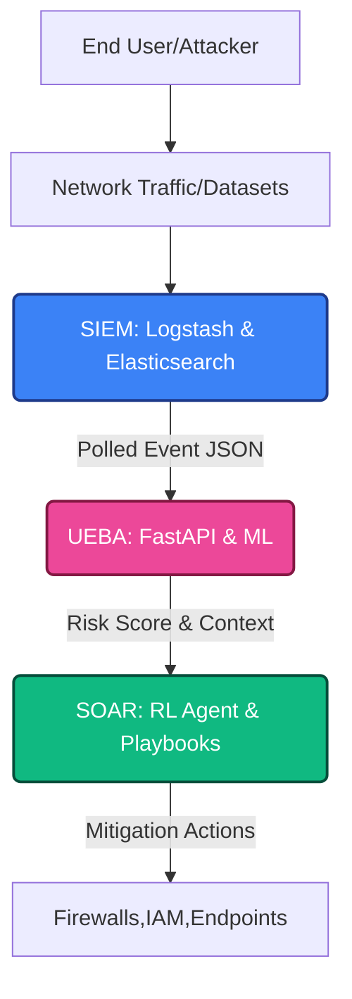
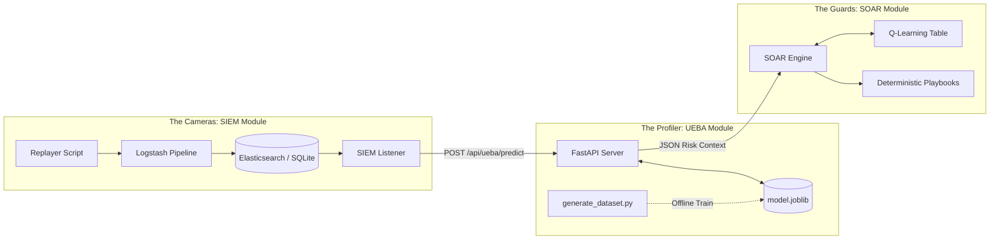

# ZenGuard Zero Trust Pipeline: Architecture

## High-Level Abstraction (C4 Context)

## System Components

## Modular Deployment vs Integrated
**Modular Usage:**
Each subsystem is heavily decoupled. 
- You can run the **UEBA offline** completely isolated by just dumping the feature engineered CSVs and running `test_unit.py`. 
- You can run the **SIEM alone** by piping CSVs through ELK without ever forwarding events out of Elasticsearch.

**Integrated Usage:**
When connected natively, `Implemetations/SIEM/siem_listener.py` bridges the gap, intercepting buffers in Elasticsearch and shooting POST requests strictly to the endpoints established in `Implemetations/UEBA_V2/model_server.py`, which translates the inputs for the final mitigation stage located remotely in the SOAR layer.
