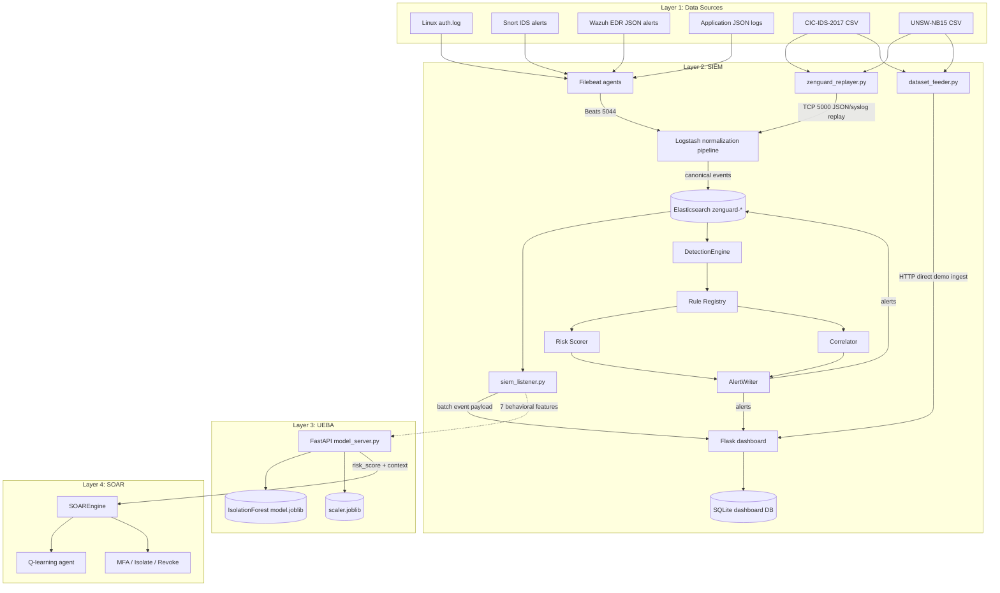
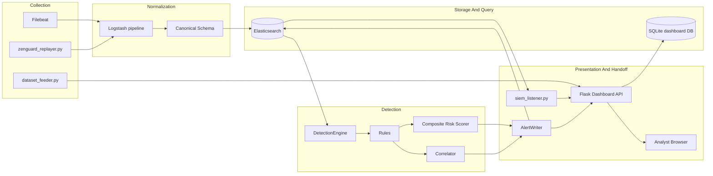
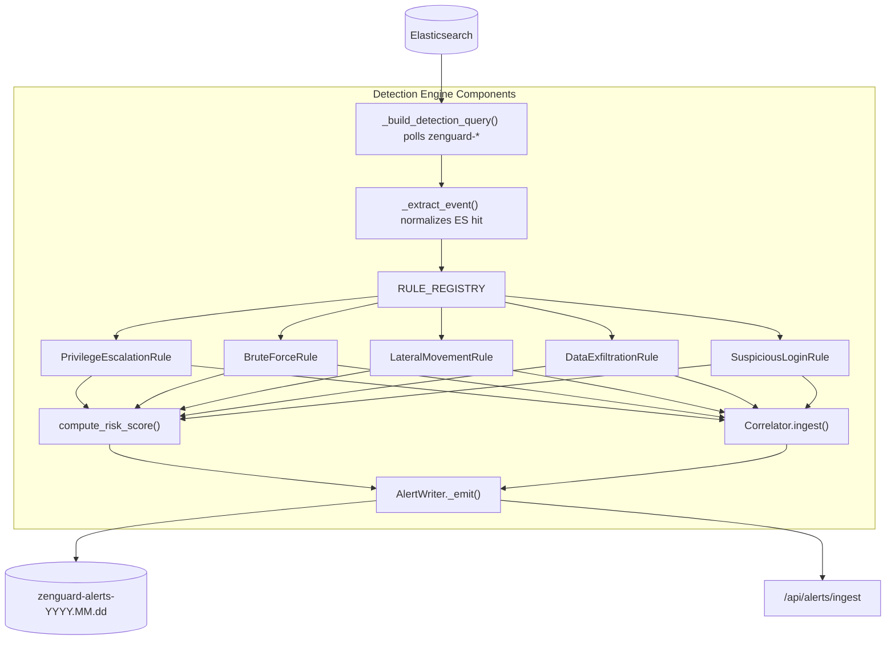

# ZenGuard SIEM Workings

## Purpose For Presentation

The SIEM layer in ZenGuard acts as the observation and normalization layer. Its responsibility is to collect endpoint, network, authentication, EDR, and dataset replay events, convert them into a single canonical security schema, persist/query them through Elasticsearch or SQLite dashboard storage, and forward actionable security evidence to the analytics and response layers.

In simple terms: SIEM is the "security camera and evidence desk" of ZenGuard. It watches everything, cleans the logs, detects known attack patterns, creates explainable alerts, and hands structured evidence to UEBA/SOAR without directly performing machine-learning decisions or mitigation.

## What Was Analyzed

Primary implementation files:

- `Implemetations/SIEM/filebeat/filebeat.yml`
- `Implemetations/SIEM/logstash/pipeline/logstash.conf`
- `Implemetations/SIEM/zenguard_replayer.py`
- `Implemetations/SIEM/siem_listener.py`
- `Implemetations/SIEM/detection_engine/engine.py`
- `Implemetations/SIEM/detection_engine/rules/*.py`
- `Implemetations/SIEM/detection_engine/correlator.py`
- `Implemetations/SIEM/detection_engine/scorer.py`
- `Implemetations/SIEM/detection_engine/alert_writer.py`
- `dashboard/app.py`
- `dataset_feeder.py`

Supporting docs:

- `Implemetations/SIEM/README.md`
- `SIEM_RUNBOOK.md`
- `docs/architecture_overview.md`

## SIEM Role In The Complete ZenGuard System

ZenGuard is divided into three security capabilities:

- SIEM: log collection, normalization, rule detection, alerting, evidence persistence.
- UEBA: behavioral feature scoring using Isolation Forest.
- SOAR: automated response using Q-learning plus deterministic policy enforcement.

The SIEM does not directly decide final user/device response. It prepares reliable, normalized evidence and either stores it for dashboard use or forwards it into the analytics path.

## Overall Architecture Diagram

## SIEM Module Level Diagram

## SIEM Component Level Diagram

## SIEM Data Flow

1. Endpoint logs are collected by Filebeat from Linux auth logs, Snort alert logs, Wazuh JSON alert logs, and custom application logs.
2. Filebeat labels each event with a `log_type` field so Logstash knows which parser branch to use.
3. Dataset and demo events can also enter through `zenguard_replayer.py`, which streams replayed CIC-IDS-2017 or UNSW-NB15 rows to Logstash over TCP.
4. Logstash parses source-specific formats and outputs a canonical event with common fields like `src_ip`, `dst_ip`, `user_id`, `event_type`, `action`, `severity`, `timestamp`, and the seven UEBA behavioral fields.
5. Elasticsearch stores normalized events in daily `zenguard-<log_source>-YYYY.MM.dd` indices.
6. `siem_listener.py` polls Elasticsearch every few seconds for security-relevant event types and creates a batch payload for dashboard/UEBA handoff.
7. The detection engine independently polls Elasticsearch, applies rules, correlates multi-stage attacks, computes a composite risk score, and emits structured alerts.
8. The Flask dashboard persists raw events and alerts to SQLite and exposes REST APIs for the browser frontend.

## Canonical Event Schema

The SIEM normalizes diverse inputs into a predictable schema:

| Field | Meaning |
| --- | --- |
| `event_id` | Unique document or generated event identifier |
| `timestamp` | Original event time |
| `src_ip` | Source IP address |
| `dst_ip` | Destination IP address |
| `user_id` | User/account involved |
| `event_type` | Normalized event class |
| `action` | Normalized action label |
| `severity` | Low, medium, high, or critical |
| `log_source` | Source type, such as `linux_auth`, `snort_ids`, `wazuh_edr`, `replayer` |
| `endpoint_id` | Host/endpoint identity where available |
| `tags` | Enrichment tags such as `possible_brute_force` |

UEBA features carried by SIEM:

| Feature | Meaning |
| --- | --- |
| `failed_logins` | Count of failed authentication attempts |
| `privilege_change_attempted` | Whether the event suggests privilege escalation |
| `external_connection` | Whether traffic leaves the trusted perimeter |
| `MFA_bypassed` | Whether MFA appears bypassed |
| `session_duration` | Session/flow duration |
| `access_time` | Access timestamp or hour source |
| `device_trust_score` | Trust value for device/entity |

## Logstash Normalization Logic

The Logstash pipeline is the main transformation engine.

Key branches:

- Replayer branch: accepts synthetic or replayed dataset events tagged with `replayer`; ensures all seven ML fields exist and are typed.
- Auth branch: parses SSH login failures/successes and sudo activity from `/var/log/auth.log`.
- Snort branch: parses IDS fast alerts and maps Snort priority to severity.
- Wazuh branch: parses JSON EDR alerts and maps Wazuh rule level to severity.
- Application branch: parses custom structured JSON logs.
- Fallback branch: assigns safe defaults for unknown log types.

Important design decisions:

- Every event exits with canonical SIEM fields.
- `event_type`, `severity`, and `action` are lowercased for consistent querying.
- GeoIP enrichment is added for source/destination IP context.
- Failed login events receive `possible_brute_force` tags for downstream scoring.

## Detection Rules

The SIEM has five implemented rule classes registered in `RULE_REGISTRY`.

| Rule | Trigger | Severity | Risk Delta | Presentation Explanation |
| --- | --- | --- | --- | --- |
| `PrivilegeEscalationRule` | `privilege_change_attempted == 1` and `MFA_bypassed == 1` | Critical | 40 | A user has bypassed MFA and is trying to gain elevated access |
| `BruteForceRule` | Failed login count reaches threshold for same user or source IP | High | 35 | Credential stuffing, password spray, or brute force |
| `LateralMovementRule` | Same source IP contacts at least 3 unique destinations and has external activity | High | 30 | Post-compromise movement across systems |
| `DataExfiltrationRule` | Long session duration plus external connection | High | 30 | Slow-and-steady exfiltration or C2 |
| `SuspiciousLoginRule` | Off-hours access plus low device trust score | Medium | 25 | Unusual login behavior from untrusted device |

## Risk Scoring

`compute_risk_score()` converts triggered rules into a final 0-100 risk score.

Base model:

- Critical rule delta is capped at 40.
- High rule delta is capped at 35.
- Medium rule delta is capped at 25.
- Low rule delta is capped at 10.
- Raw sum is capped at 100.

Co-occurrence bonuses:

- Brute force plus privilege escalation: +10.
- Lateral movement plus data exfiltration: +10.
- Suspicious login plus brute force: +5.
- Privilege escalation plus lateral movement plus exfiltration: +15.

Presentation point: The SIEM score is explainable because each score includes contributing rules and bonus reasons. This makes it suitable for SOC dashboards and audit review.

## Correlation Engine

The correlator maintains an in-memory sliding window per `(user_id, src_ip)` and looks for attack chains.

Implemented chains:

- `full_kill_chain`: brute force, privilege escalation, lateral movement, and data exfiltration.
- `apt_campaign`: brute force, lateral movement, and data exfiltration.
- `account_compromise`: brute force and privilege escalation.
- `insider_threat`: suspicious login and data exfiltration.
- `mfa_bypass_escalation`: privilege escalation and lateral movement.

Presentation point: Single events become stronger evidence when connected over time. The correlator upgrades isolated alerts into incident-level narratives.

## Alert Output

`AlertWriter` sends alerts to two destinations:

- Elasticsearch: `zenguard-alerts-YYYY.MM.dd`
- Dashboard: `/api/alerts/ingest`

Alert payload includes:

- `alert_id`
- `alert_type`
- `severity`
- `user_id`
- `src_ip`
- `dst_ip`
- `reason`
- `risk_score`
- `risk_score_breakdown`
- `is_correlated`
- `correlated_chain`
- `source_events`
- `zenguard_layer`

This supports traceability from alert back to original evidence.

## Dashboard And Persistence

The Flask dashboard in `dashboard/app.py` provides:

- `POST /api/ingest`: stores raw normalized event batches.
- `POST /api/alerts/ingest`: stores structured detection alerts.
- `GET /api/events`: serves event lists and summary stats.
- `GET /api/stats`: serves dashboard aggregates.
- `GET /api/alerts`: serves detection alerts.
- Stub SOAR endpoints: `/api/soar/block_ip`, `/api/soar/isolate`, `/api/soar/mfa`, `/api/soar/whitelist`.

SQLite tables:

- `events`: stores normalized event records.
- `alerts`: stores detection alerts separately from raw events.

## Dataset And Demo Support

There are two SIEM demo paths:

1. `zenguard_replayer.py`: maps CIC/UNSW dataset rows to ZenGuard schema, synthesizes identity features, and streams to Logstash.
2. `dataset_feeder.py`: bypasses ELK and sends normalized batches directly to the Flask dashboard for fast presentation demos.

The replayer supports both file/folder replay and synthetic scenario triggers:

- privilege escalation
- brute force
- MFA bypass
- all scenarios

## Slide-Ready Talking Points

- ZenGuard SIEM starts with reliable collection: Filebeat, Logstash, Elasticsearch, and replay support.
- The main engineering value is normalization: unrelated security sources are converted into one schema.
- The SIEM emits both raw events and explainable alerts.
- Detection rules cover credential attacks, suspicious access, escalation, lateral movement, and exfiltration.
- Correlation turns multiple weak signals into attack-chain evidence.
- The SIEM remains decoupled: it prepares intelligence but does not perform final UEBA model inference or SOAR mitigation decisions.

## Strengths

- Clean separation between ingestion, normalization, detection, scoring, correlation, and alert writing.
- Rich explainability through rule `reason` fields and score breakdowns.
- Strong demo support through CIC-IDS-2017, UNSW-NB15, replayer scenarios, and direct feeder mode.
- Resilient polling loops with retries and non-fatal dashboard POST handling.
- Environment-driven configuration for ports, thresholds, Elasticsearch URLs, and polling windows.

## Current Limitations

- Correlation state is in memory, so it is lost on restart and not shared across multiple SIEM instances.
- Some demo paths bypass Elasticsearch for speed, so presentation should distinguish production-like ELK flow from dashboard-only feeder flow.
- SIEM dashboard risk score is a lightweight deterministic score; UEBA produces the ML risk score separately.
- Logstash comments mention `json` replay behavior, but the active TCP input uses `codec => line`; replayed dictionaries are serialized as JSON lines by the sender and then processed in the replayer branch.
- Hardcoded default credentials and plaintext ports are acceptable for prototype/demo but should be replaced for production.

## Suggested PPT Slide Structure

1. SIEM objective: collect, normalize, detect, alert.
2. Data sources: Filebeat, Snort, Wazuh, auth logs, app logs, CIC/UNSW datasets.
3. Normalization pipeline: Logstash branches and canonical schema.
4. Detection engine: rule registry and five rules.
5. Risk scoring and correlation: explainable score plus attack-chain detection.
6. Dashboard and outputs: SQLite, REST APIs, alerts, analyst view.
7. SIEM handoff: seven UEBA features passed forward.
8. Strengths and limitations.

