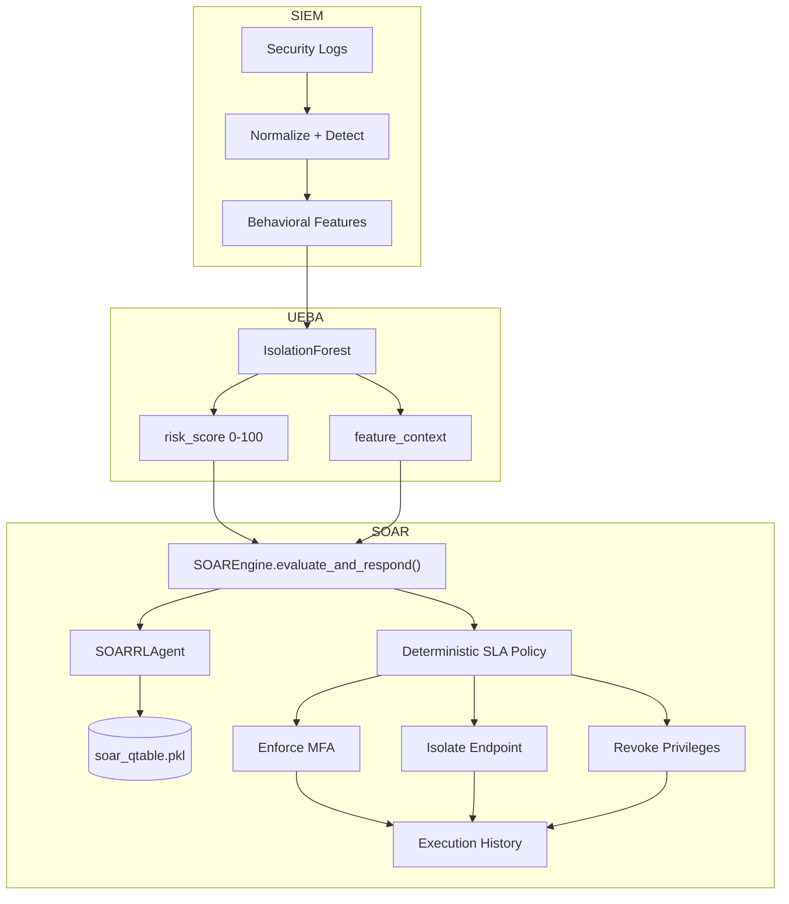
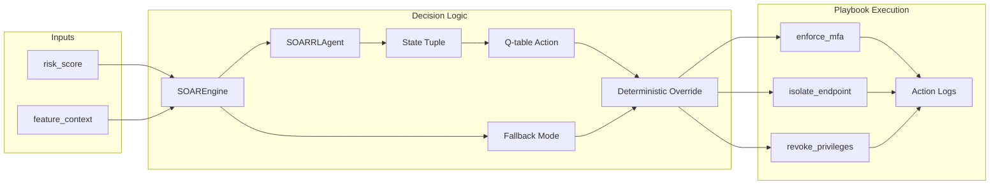
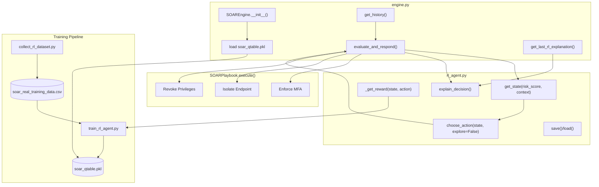
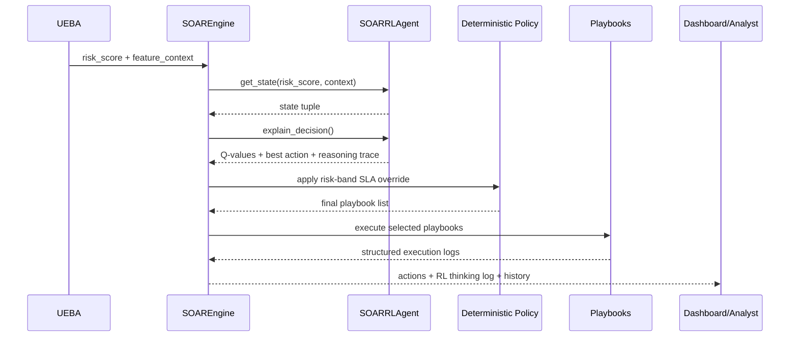

# ZenGuard SOAR Workings

## Purpose For Presentation

The SOAR layer is the autonomous response layer of ZenGuard. It receives risk information from UEBA, determines the required security response, executes simulated playbooks, and records the action history for analyst visibility.

In simple terms: SOAR is the "response command center." SIEM observes, UEBA decides how risky the behavior is, and SOAR chooses what defensive action to take.

## What Was Analyzed

Primary implementation files:

- `Implemetations/SOAR/engine.py`
- `Implemetations/SOAR/rl_agent.py`
- `Implemetations/SOAR/train_rl_agent.py`
- `Implemetations/SOAR/collect_rl_dataset.py`
- `Implemetations/SOAR/soar_real_training_data.csv`
- `Implemetations/SOAR/soar_qtable.pkl`
- `Implemetations/SOAR/test_soar_rules.py`
- `Implemetations/SOAR/TEST_CASES.md`
- `Implemetations/Integration/dashboard.py`
- `Implemetations/Integration/test_scenarios_runner.py`
- `Implemetations/Integration/test_rl_thinking.py`
- `dashboard_v2/simulator.py`

Supporting docs:

- `Implemetations/SOAR/README.md`
- `Implemetations/SOAR/integration_handoff.md`
- `docs/adr/0001-ueba-soar-contract.md`
- `docs/simple_soar_training_explain.md`

## SOAR Role In The Complete ZenGuard System

SOAR is downstream of SIEM and UEBA.

- SIEM supplies evidence and normalized event context.
- UEBA supplies risk score and selected context fields.
- SOAR selects and executes response playbooks.

The SOAR module deliberately does not parse packet captures, query Elasticsearch, or load ML model artifacts. Its interface is a security response contract: `risk_score` plus `feature_context`.

## Overall Architecture Diagram



## SOAR Module Level Diagram



## SOAR Component Level Diagram



## SOAR Input Contract

The SOAR engine expects:

```json
{
  "risk_score": 95,
  "feature_context": {
    "MFA_bypassed": 1,
    "privilege_change_attempted": 1,
    "is_anomaly": true
  }
}
```

Required operational fields:

- `risk_score`: integer security risk value from 0 to 100.
- `feature_context.MFA_bypassed`: used for prioritization and RL state.
- `feature_context.is_anomaly`: used when available to mark anomaly state.
- `feature_context.privilege_change_attempted`: passed through for context and future policy expansion.

## Implemented Playbooks

`SOAREngine` defines three playbooks:

| Key | Playbook Name | Purpose |
| --- | --- | --- |
| `enforce_mfa` | Enforce MFA | Trigger multi-factor authentication challenge |
| `isolate_endpoint` | Isolate Endpoint | Quarantine device through EDR-style integration |
| `revoke_privileges` | Revoke Privileges | Temporarily revoke admin privileges and terminate active sessions |

In the current prototype, playbooks simulate execution and return a structured log:

- `timestamp`
- `playbook`
- `action`
- `status`
- `target`

Production replacement points:

- Identity provider API for MFA enforcement.
- EDR/Wazuh/CrowdStrike API for endpoint isolation.
- IAM/AD/Okta/Azure AD API for session termination and privilege revocation.

## Deterministic Response Policy

The engine uses risk bands to guarantee safety:

| Risk Score | Band | Triggered Playbooks |
| --- | --- | --- |
| 0-49 | Low | None, except possible RL edge-case MFA in current code |
| 50-74 | Medium | Enforce MFA |
| 75-94 | High | Enforce MFA + Isolate Endpoint |
| 95-100 | Critical | Enforce MFA + Isolate Endpoint + Revoke Privileges |

Critical point for presentation: even though the system has a Q-learning agent, the final response is protected by deterministic policy. This prevents the RL agent from under-responding to critical threats.

## RL Agent Design

`SOARRLAgent` implements Q-learning.

State space:

```text
(risk_band, mfa_bypassed, anomaly_flag)
```

Risk band values:

- `0`: low, 0-49.
- `1`: medium, 50-74.
- `2`: high, 75-94.
- `3`: critical, 95-100.

Other state values:

- `mfa_bypassed`: 0 or 1.
- `anomaly_flag`: 0 or 1.

Action space:

| Action ID | Meaning |
| --- | --- |
| 0 | Do nothing |
| 1 | Enforce MFA only |
| 2 | Isolate endpoint only |
| 3 | Revoke privileges only |
| 4 | Enforce MFA + isolate endpoint |
| 5 | Enforce MFA + revoke privileges |
| 6 | All three playbooks |

## Reward Logic

Reward design pushes the agent toward proportional response:

- Low risk plus no action receives positive reward.
- Critical risk plus no action receives strong penalty.
- Critical risk plus all playbooks receives high reward.
- Low/medium risk plus excessive action receives penalty.
- Medium/high risk receives reward for suitable partial responses.
- MFA bypass gives bonus reward to actions that include MFA enforcement.

Presentation point: The RL agent is trained to balance security response strength with operational friction.

## RL Training Pipeline

Training is intentionally tied to real UEBA distributions instead of purely synthetic random states.

`collect_rl_dataset.py`:

1. Loads UEBA `ueba_dataset.csv`.
2. Loads UEBA `model.joblib` and `scaler.joblib`.
3. Scores all UEBA rows using the same risk mapping style as `model_server.py`.
4. Saves a compact SOAR training dataset containing:
   - `risk_score`
   - `MFA_bypassed`
   - `is_anomaly`

`train_rl_agent.py`:

1. Loads `soar_real_training_data.csv`.
2. Iterates through actual UEBA-derived rows.
3. Builds RL state from risk/context.
4. Chooses actions with exploration.
5. Applies reward.
6. Updates Q-values.
7. Decays epsilon toward `0.05`.
8. Saves `soar_qtable.pkl`.

The old synthetic `train()` method in `rl_agent.py` is disabled and raises an error instructing users to collect real UEBA distributions first.

## Decision Flow



## RL Thinking Log

The SOAR module includes transparency through `explain_decision()`.

The explanation includes:

- Input risk score.
- Derived state.
- Q-values for all seven actions.
- Best RL action.
- Notes about MFA bypass reward.
- Warning if deterministic policy overrides RL.
- Confirmation when RL agrees with deterministic policy.

`Integration/test_rl_thinking.py` demonstrates this with four scenarios:

- Normal activity.
- Brute force medium risk.
- High-risk anomaly.
- Critical MFA bypass.

Presentation point: ZenGuard does not hide AI decisions. It shows what the RL agent preferred and whether policy had to override it.

## Integration Dashboard Flow

`Implemetations/Integration/dashboard.py` connects UEBA and SOAR:

1. User enters manual features or pastes SIEM JSON.
2. UEBA model produces anomaly prediction, raw score, and risk score.
3. SOAR evaluates risk score and context.
4. Dashboard shows:
   - risk score
   - risk band
   - target response
   - executed playbooks
   - SOAR execution history
   - RL thinking trace

This is the best presentation interface for explaining end-to-end behavior.

## Test Scenarios

`Integration/test_scenarios_runner.py` verifies four expected outcomes:

| Scenario | Expected Band | Expected Playbooks |
| --- | --- | --- |
| Normal activity | Low | 0 |
| Brute force attempt | Medium | 1 |
| High-risk anomaly | High | 2 |
| Critical MFA bypass | Critical | 3 |

`SOAR/TEST_CASES.md` provides ten manual JSON scenarios, including:

- Perfectly normal employee.
- Employee typo mistakes.
- Untrusted device.
- Late-night admin.
- Suspicious privilege request.
- Brute force attack.
- Session hijack.
- Rogue admin.
- Persistent external attacker.
- Nuclear scenario.

## Slide-Ready Talking Points

- SOAR converts risk into action.
- The engine uses both AI and deterministic policy.
- Q-learning recommends proportionate responses based on learned rewards.
- Deterministic override guarantees critical security SLAs.
- Playbooks are modular and replaceable with real IdP/EDR/IAM APIs.
- The thinking log makes the AI decision auditable for analysts.
- The system stores execution history for dashboard review.

## Strengths

- Clear risk-band response policy.
- RL agent adds adaptive decision support without removing deterministic safety.
- Playbook interface is simple and easy to replace with real integrations.
- Training data comes from UEBA model distributions, tying response learning to actual detection behavior.
- The thinking log improves explainability and presentation value.
- Fallback mode protects the system if Q-table loading fails.

## Current Limitations

- Playbooks are simulated and do not call real IdP, EDR, firewall, or IAM APIs yet.
- The deterministic policy currently dominates final response for medium, high, and critical bands; RL is mostly advisory in those cases.
- `SOARPlaybook.execute()` defaults target to `"Unknown"` because `evaluate_and_respond()` currently passes context but not a specific `user_id`.
- The fallback mode only triggers action for critical risk `>=95`; medium/high handling depends on RL availability.
- The current Q-table state space is compact, which is good for demo, but production response would benefit from richer state such as asset criticality, user role, alert type, and previous incidents.

## Suggested PPT Slide Structure

1. SOAR objective: automated response and mitigation.
2. Input contract: risk score plus feature context.
3. Playbook library: MFA, isolation, revoke privileges.
4. RL state/action design.
5. Reward model and training from UEBA distributions.
6. Deterministic SLA policy.
7. Decision sequence diagram.
8. RL thinking log and analyst transparency.
9. Test scenarios and expected results.
10. Strengths, limitations, and future work.

