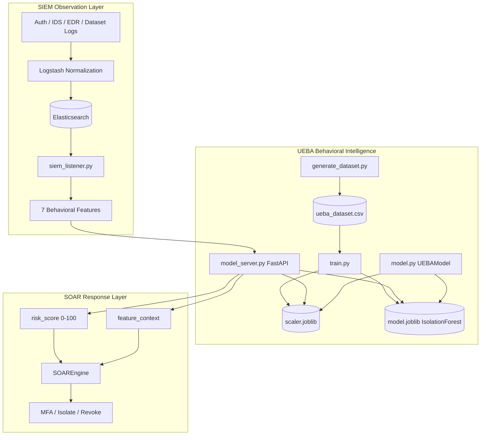
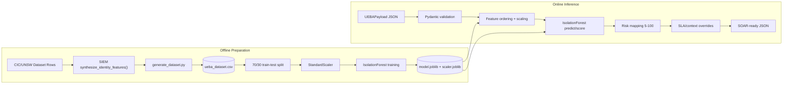
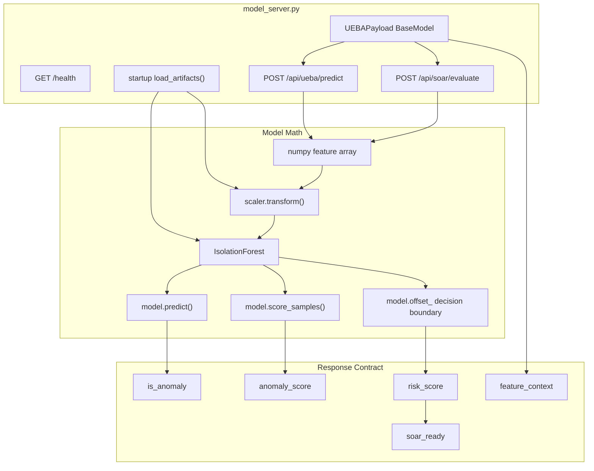

# ZenGuard UEBA Workings

## Purpose For Presentation

The UEBA layer is the behavioral intelligence layer of ZenGuard. It receives the seven behavioral features produced by SIEM, evaluates whether the user/entity behavior is normal or anomalous using an unsupervised Isolation Forest model, and translates the model output into a security-friendly risk score that SOAR can consume.

In simple terms: UEBA is the "behavioral profiler." It learns what normal activity looks like and highlights unusual activity such as brute force behavior, off-hours access, low-trust devices, MFA bypass, suspicious privilege activity, and long external sessions.

## What Was Analyzed

Primary implementation files:

- `Implemetations/UEBA/generate_dataset.py`
- `Implemetations/UEBA/train.py`
- `Implemetations/UEBA/model.py`
- `Implemetations/UEBA/model_server.py`
- `Implemetations/UEBA/ueba_dataset.csv`
- `Implemetations/UEBA/model.joblib`
- `Implemetations/UEBA/scaler.joblib`
- `Implemetations/UEBA/test_unit.py`
- `Implemetations/UEBA/test_integration.py`
- `Implemetations/UEBA/dashboard/run_dashboard.py`
- `dashboard_v2/simulator.py`

Supporting docs:

- `Implemetations/UEBA/README.md`
- `docs/adr/0001-ueba-soar-contract.md`
- `docs/architecture_overview.md`

## UEBA Role In The Complete ZenGuard System

UEBA sits between SIEM and SOAR.

- Input from SIEM: structured behavioral feature vector.
- ML engine: Isolation Forest plus StandardScaler.
- Output to SOAR: integer `risk_score`, anomaly status, raw anomaly score, and feature context.

The important architectural decision is that SOAR does not import data-science libraries. UEBA owns the model, scaler, feature transformation, and risk-score translation.

## Overall Architecture Diagram



## UEBA Module Level Diagram



## UEBA Component Level Diagram



## UEBA Feature Vector

The model uses seven behavioral features:

| Feature | Type | Meaning |
| --- | --- | --- |
| `failed_logins` | Integer | Authentication failure volume |
| `privilege_change_attempted` | Integer 0/1 | Whether user attempted elevated access |
| `external_connection` | Integer 0/1 | Whether the session leaves trusted network perimeter |
| `MFA_bypassed` | Integer 0/1 | Whether MFA appears skipped or bypassed |
| `session_duration` | Float | Length of user/session/network activity |
| `access_hour` or `access_time` | Integer hour | Hour of access, used to detect off-hours behavior |
| `device_trust_score` | Float 0-1 | Trust level of device/entity |

Important implementation detail:

- `generate_dataset.py` writes `access_hour`.
- `model_server.py` expects `access_hour`.
- `model.py` is used by the Streamlit integration and accepts `access_time`, then renames it internally to `access_hour` before scaling.

## Dataset Generation Flow

`generate_dataset.py` builds `ueba_dataset.csv`.

Process:

1. Locate CSVs inside the project `Datasets` directory.
2. Read each dataset with `csv.DictReader`.
3. Detect the label column using `Label` or `attack_cat`.
4. Convert raw labels into `attack_category`.
5. Build a minimal flow containing the attack category and access time.
6. Reuse SIEM's `synthesize_identity_features()` from `zenguard_replayer.py`.
7. Extract the seven UEBA features.
8. Save rows into `ueba_dataset.csv` with an additional `attack_category` field.

Presentation point: Since CIC-IDS-2017 and UNSW-NB15 are network-flow datasets, they do not naturally contain identity signals like MFA bypass or device trust. ZenGuard synthesizes these identity/security features from attack categories to build a UEBA-ready training dataset.

## Training Flow

`train.py` trains the model.

Steps:

1. Load `ueba_dataset.csv`.
2. Drop rows with missing feature values.
3. Convert `attack_category` into evaluation labels:
   - `1` for benign/normal.
   - `-1` for attack/anomaly.
4. Split dataset into 70 percent train and 30 percent test.
5. Fit `StandardScaler` on training features.
6. Train `IsolationForest` with:
   - `n_estimators=150`
   - `contamination=0.05`
   - `random_state=42`
   - `n_jobs=-1`
7. Save `model.joblib` and `scaler.joblib`.
8. Validate using classification report and confusion matrix on the hold-out set.

Why Isolation Forest:

- Works for unsupervised anomaly detection.
- Efficient for large tabular data.
- Does not require perfect labeled attack training.
- Produces anomaly decisions suitable for behavioral outlier detection.

## Inference Endpoints

The FastAPI server in `model_server.py` exposes:

| Endpoint | Purpose | Output |
| --- | --- | --- |
| `GET /health` | Service status and model-load check | `status`, `model_loaded` |
| `POST /api/ueba/predict` | Diagnostic ML endpoint | `is_anomaly`, `anomaly_score` |
| `POST /api/soar/evaluate` | SOAR bridge endpoint | `risk_score`, `is_anomaly`, `anomaly_score`, `feature_context`, `soar_ready` |

`UEBAPayload` requires:

```json
{
  "failed_logins": 0,
  "privilege_change_attempted": 0,
  "external_connection": 0,
  "MFA_bypassed": 0,
  "session_duration": 1.5,
  "access_hour": 14,
  "device_trust_score": 0.9
}
```

## Risk Score Translation

The ML model produces raw Isolation Forest scores. SOAR needs a simple integer risk score.

`model_server.py` maps the raw score into risk bands:

- Normal zone: raw score above or equal to model `offset_` maps to risk `5-74`.
- Anomaly zone: raw score below model `offset_` maps to risk `75-100`.
- Final score is clipped between `5` and `100`.

Critical override:

- If `MFA_bypassed == 1` and `failed_logins > 3`, the risk score becomes `100`.

This makes the model safer for security use: mathematically borderline scores cannot understate strict policy violations.

## SOAR Bridge Contract

The SOAR bridge endpoint returns:

```json
{
  "risk_score": 100,
  "is_anomaly": true,
  "anomaly_score": -0.63,
  "feature_context": {
    "MFA_bypassed": 1,
    "privilege_change_attempted": 1
  },
  "soar_ready": true
}
```

The bridge contract matters because:

- SOAR does not need scikit-learn, numpy, or joblib.
- SOAR receives a normalized `risk_score`.
- SOAR receives context fields required by deterministic policy.
- The architecture stays decoupled: UEBA owns data science; SOAR owns response.

## Integrated Streamlit UEBA Flow

`Implemetations/Integration/dashboard.py` uses:

- `UEBA.model.UEBAModel`
- `SOAR.engine.SOAREngine`

Flow:

1. Analyst enters manual values or pastes SIEM JSON.
2. Dashboard builds a DataFrame with the seven features.
3. `UEBAModel.predict()` orders and scales the feature vector.
4. Isolation Forest returns anomaly prediction and raw score.
5. Risk score is calibrated into a 0-100 value with context-aware boosts.
6. SOAR receives risk score and feature context.
7. Dashboard displays risk band, expected response, executed playbooks, and RL thinking log.

## Live War Room UEBA Flow

`dashboard_v2/simulator.py` implements a live presentation flow:

1. Load CICIDS dataset files in scenario order.
2. Sample rows in chunks to keep the demo human-readable.
3. Engineer seven behavioral features from network-flow columns.
4. Score locally using the UEBA model and scaler.
5. Query SOAR RL agent for action selection.
6. Publish full SIEM, UEBA, and SOAR envelope to browser clients through Server-Sent Events.

This gives a powerful demo path where the audience can see raw network flow, UEBA features, risk output, and SOAR response in real time.

## UEBA Risk Bands For PPT

| Risk Score | Band | Meaning | Expected SOAR Response |
| --- | --- | --- | --- |
| 0-49 | Low | Normal or acceptable behavior | No automated playbook |
| 50-74 | Medium | Suspicious but not severe | Enforce MFA |
| 75-94 | High | Strong anomaly or risky behavior | Enforce MFA + isolate endpoint |
| 95-100 | Critical | Severe anomaly or policy violation | Enforce MFA + isolate endpoint + revoke privileges |

## Example Scenarios

Normal employee:

- Low failed logins.
- Business-hour access.
- High device trust.
- No external suspicious session.
- Expected output: low risk, no SOAR action.

Brute force attempt:

- High failed login count.
- Low trust score.
- External connection.
- Expected output: medium or higher risk, MFA enforcement.

High-risk anomaly:

- Long session.
- Off-hours access.
- Low trust score.
- Privilege change attempt.
- Expected output: high risk, MFA plus endpoint isolation.

Critical MFA bypass:

- MFA bypassed.
- Privilege change attempted or failed login abuse.
- Low trust and external connection.
- Expected output: critical risk, all SOAR playbooks.

## Slide-Ready Talking Points

- UEBA converts SIEM evidence into behavioral intelligence.
- The model is unsupervised, so it can identify unusual patterns without needing every attack type pre-labeled.
- StandardScaler keeps different feature ranges comparable.
- Isolation Forest separates normal dense behavior from isolated outliers.
- The UEBA API translates mathematical anomaly scores into operational security risk.
- Context-aware overrides protect against false calm when strict security conditions are violated.
- UEBA and SOAR are decoupled through a clean JSON contract.

## Strengths

- Clear offline/online separation: generate dataset, train model, serve inference.
- FastAPI endpoint makes the model usable by any service.
- The SOAR bridge avoids leaking ML internals into the response engine.
- Uses a simple and explainable seven-feature vector.
- Risk mapping is designed around SOC bands, not just model output.
- Demo and integration flows reuse the same conceptual feature contract.

## Current Limitations

- Identity features are synthesized from network datasets, not collected from a real identity provider in this prototype.
- `model.py` and `model_server.py` contain similar but not identical risk mapping logic, so future cleanup should centralize calibration.
- `model_server.py` uses empirical score anchors `-0.40` and `-0.80`; those should be recalibrated if the dataset or model changes significantly.
- The FastAPI server allows all CORS origins, which is fine for demo but should be restricted in production.
- The model is unsupervised but evaluated against labels; presentation should explain that labels are used for validation, not supervised training.

## Suggested PPT Slide Structure

1. UEBA objective: behavioral profiling and anomaly scoring.
2. Seven-feature input vector.
3. Dataset generation and feature synthesis.
4. Training pipeline: scaler, Isolation Forest, model artifacts.
5. Live inference API endpoints.
6. Risk score translation and security overrides.
7. UEBA to SOAR contract.
8. Demo scenarios and expected bands.
9. Strengths and limitations.

