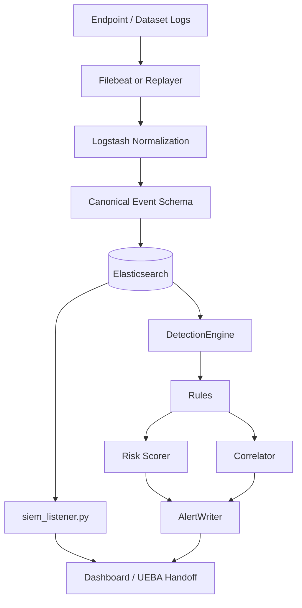
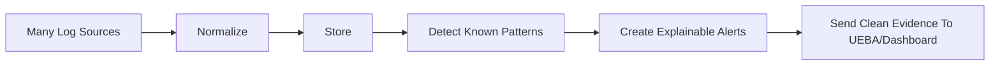

# SIEM Developer Simple Guide

## Who This Doc Is For

This doc is for the developer who worked on the SIEM module independently. It explains your module in simple words, what happens inside it, what you should say in a presentation, and how your work connects with the UEBA and SOAR developers' work.

## One-Line Explanation

The SIEM module is the security camera system of ZenGuard: it collects logs, cleans them, stores them, detects obvious suspicious patterns, and sends useful security evidence forward.

## Simple Analogy

Imagine a large university campus.

- CCTV cameras watch doors, corridors, and labs.
- Security guards write incident notes.
- Entry gates record ID card scans.
- Fire alarms and motion sensors create alerts.

All these records come in different formats. The SIEM is like the control room operator who takes all those messy records and writes them into one common incident register.

That common incident register is then used by:

- UEBA, which behaves like a behavior expert asking: "Is this person's behavior unusual?"
- SOAR, which behaves like the response team asking: "What should we do now?"

## What The SIEM Module Actually Does

The SIEM module does four main jobs:

1. Collect logs from different places.
2. Convert those logs into one standard format.
3. Detect known suspicious patterns using rules.
4. Send events and alerts to the dashboard and downstream modules.

It does not train the ML model. It does not decide final automated response. It prepares reliable evidence.

## Main Files You Should Know

| File | Simple Purpose |
| --- | --- |
| `Implemetations/SIEM/filebeat/filebeat.yml` | Tells endpoints which log files to send |
| `Implemetations/SIEM/logstash/pipeline/logstash.conf` | Cleans and converts all incoming logs into one schema |
| `Implemetations/SIEM/zenguard_replayer.py` | Replays dataset/synthetic events into Logstash for demos |
| `Implemetations/SIEM/siem_listener.py` | Polls Elasticsearch and forwards useful event batches |
| `Implemetations/SIEM/detection_engine/engine.py` | Runs SIEM rules and creates alerts |
| `Implemetations/SIEM/detection_engine/rules/*.py` | Individual detection rules |
| `Implemetations/SIEM/detection_engine/correlator.py` | Combines multiple alerts into attack-chain alerts |
| `Implemetations/SIEM/detection_engine/scorer.py` | Calculates SIEM risk score from triggered rules |
| `Implemetations/SIEM/detection_engine/alert_writer.py` | Writes alerts to Elasticsearch and dashboard |
| `dashboard/app.py` | Flask dashboard backend storing events and alerts |

## What Happens Inside SIEM, Step By Step

### Step 1: Logs Are Collected

Filebeat collects logs from:

- Linux authentication logs.
- Snort IDS alerts.
- Wazuh EDR alerts.
- Custom app logs.

For demos, `zenguard_replayer.py` can also replay CIC-IDS-2017 and UNSW-NB15 dataset rows.

Think of this step as "all cameras and sensors sending their recordings to the control room."

### Step 2: Logstash Cleans The Logs

Different logs look different.

For example:

- SSH logs look like text.
- Snort alerts look like IDS alert lines.
- Wazuh logs are JSON.
- Dataset events are replayed/synthesized.

Logstash converts all of them into the same format.

The common fields are:

- `src_ip`
- `dst_ip`
- `user_id`
- `event_type`
- `action`
- `severity`
- `timestamp`
- `log_source`

This is important because UEBA and SOAR should not care whether the original log came from Snort, Wazuh, auth logs, or a dataset.

### Step 3: SIEM Adds Seven Behavioral Features

The SIEM makes sure events contain the seven important UEBA features:

| Feature | Simple Meaning |
| --- | --- |
| `failed_logins` | How many login failures happened |
| `privilege_change_attempted` | Did the user try to become admin/root |
| `external_connection` | Did traffic go outside the trusted network |
| `MFA_bypassed` | Was MFA skipped or bypassed |
| `session_duration` | How long the session lasted |
| `access_time` | When the access happened |
| `device_trust_score` | How trusted the device is |

These features are the bridge from SIEM to UEBA.

### Step 4: Events Are Stored

After normalization, Logstash writes events into Elasticsearch indexes like:

```text
zenguard-linux_auth-YYYY.MM.dd
zenguard-snort_ids-YYYY.MM.dd
zenguard-wazuh_edr-YYYY.MM.dd
zenguard-replayer-YYYY.MM.dd
```

The dashboard also stores events and alerts in SQLite for easy presentation.

### Step 5: SIEM Listener Polls For Important Events

`siem_listener.py` checks Elasticsearch every few seconds.

It looks for important event types like:

- failed logins
- Snort alerts
- privilege escalation
- Wazuh alerts
- port scans

Then it creates a clean JSON batch payload.

This payload can be sent to the dashboard and can also be used as the handoff to UEBA.

### Step 6: Detection Engine Runs Rules

The SIEM detection engine applies rules to recent events.

The rule list is registered in `RULE_REGISTRY`.

Implemented rules:

| Rule | What It Detects |
| --- | --- |
| `PrivilegeEscalationRule` | MFA bypass plus privilege change attempt |
| `BruteForceRule` | Too many failed logins |
| `LateralMovementRule` | One source IP contacting many destinations |
| `DataExfiltrationRule` | Long external session |
| `SuspiciousLoginRule` | Off-hours login from low-trust device |

### Step 7: Risk Score Is Calculated

Each rule adds points.

Examples:

- Critical privilege escalation can add 40 points.
- Brute force can add 35 points.
- Suspicious login can add 25 points.

If multiple dangerous events happen together, bonus points are added.

Example:

```text
brute_force + privilege_escalation = stronger evidence of account compromise
```

### Step 8: Correlator Finds Attack Stories

One event may not tell the full story.

The correlator looks for combinations:

- brute force followed by privilege escalation
- suspicious login followed by data exfiltration
- brute force plus lateral movement plus exfiltration
- full kill chain

This is like saying:

"This is not one random alert. This is a complete attack sequence."

### Step 9: Alerts Are Written

`AlertWriter` sends alerts to:

- Elasticsearch alert index.
- Dashboard API.

Each alert includes:

- alert type
- severity
- risk score
- affected user
- source IP
- reason list
- source events
- whether it is correlated

## SIEM Data Flow Diagram



## How SIEM Connects With UEBA

UEBA needs clean behavior features.

SIEM gives UEBA:

```json
{
  "failed_logins": 8,
  "privilege_change_attempted": 0,
  "external_connection": 1,
  "MFA_bypassed": 0,
  "session_duration": 0.2,
  "access_hour": 22,
  "device_trust_score": 0.3
}
```

UEBA then decides:

- Is this behavior normal?
- Is this an anomaly?
- What is the ML risk score?

Your SIEM role ends after sending clean and correct evidence.

## How SIEM Connects With SOAR

SIEM does not directly tell SOAR what to do.

The clean architecture is:

```text
SIEM -> UEBA -> SOAR
```

SIEM provides evidence.
UEBA converts evidence into risk.
SOAR converts risk into action.

However, the dashboard has some stub SOAR endpoints for demo actions like block IP, isolate, MFA, and whitelist.

## What You Should Say In Presentation

Use this simple explanation:

"My SIEM module collects security events from multiple sources like auth logs, Snort, Wazuh, app logs, and datasets. Since every source has a different format, Logstash normalizes everything into one common schema. Then the detection engine checks for attacks like brute force, privilege escalation, lateral movement, suspicious login, and data exfiltration. It calculates an explainable risk score and writes alerts to the dashboard. The final output from SIEM is clean security evidence that UEBA can analyze."

## Questions You Should Be Able To Answer

### What problem does SIEM solve?

It solves the problem of messy security data. Logs come from different tools in different formats. SIEM collects, normalizes, stores, and searches them.

### Why do we need Logstash?

Logstash converts raw logs into one standard format. Without it, every module would need separate parsers for auth logs, Snort, Wazuh, datasets, and apps.

### Why do we need Elasticsearch?

Elasticsearch stores normalized events and makes them searchable. The listener and detection engine can poll recent events from it.

### What is the difference between SIEM risk and UEBA risk?

SIEM risk is rule-based and explainable. It comes from known conditions like failed logins or privilege escalation.

UEBA risk is ML-based. It comes from whether the behavior looks abnormal compared with learned patterns.

### Does SIEM perform ML?

No. SIEM prepares data and applies rules. UEBA performs ML.

### Does SIEM execute response actions?

No. SOAR executes response actions. SIEM may show actions in dashboard stubs, but final automated response belongs to SOAR.

### Why are the seven features important?

They are the common language between SIEM and UEBA. They convert raw technical logs into behavior signals.

### What happens if dashboard is down?

The SIEM listener and alert writer log the dashboard POST failure but continue running. The main pipeline is designed not to crash just because the dashboard is unavailable.

### What is correlation?

Correlation means connecting multiple alerts over time to detect a bigger attack story.

Example:

```text
brute force -> privilege escalation -> lateral movement -> exfiltration
```

That is more serious than one failed login alert.

## Common Mistakes To Avoid While Explaining

- Do not say SIEM trains the ML model.
- Do not say SIEM decides the final SOAR response.
- Do not say raw datasets directly become ML predictions without feature engineering.
- Do not mix up `access_time` and `access_hour`; SIEM often stores access time, UEBA server expects access hour.
- Do not present dashboard-only feeder mode as the full production ELK flow. It is a demo shortcut.

## Your Module In One Diagram



## Final Simple Summary

The SIEM module is responsible for seeing and organizing everything. It turns messy logs into clean security events, detects known threats with rules, connects related alerts, calculates explainable risk, and hands clean evidence to the next modules.

