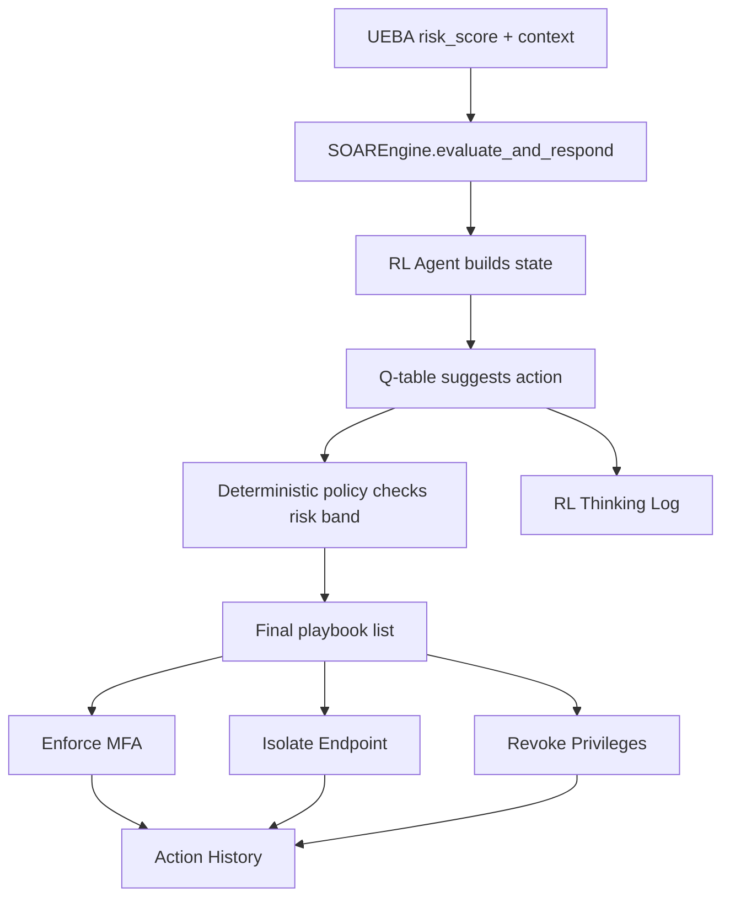
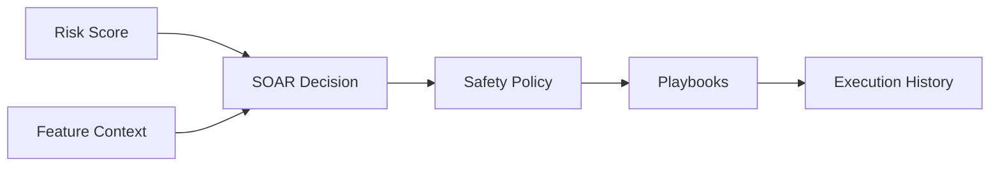

# SOAR Developer Simple Guide

## Who This Doc Is For

This doc is for the developer who worked on the SOAR module independently. It explains your module in simple words, what happens inside it, how it connects to SIEM and UEBA, and how to answer detailed questions during presentation or viva.

## One-Line Explanation

The SOAR module is the automated response team of ZenGuard: it receives a risk score and decides which security actions to execute.

## Simple Analogy

Imagine a hospital emergency room.

- SIEM is the nurse who records symptoms.
- UEBA is the doctor who gives a severity score.
- SOAR is the emergency response team that acts based on severity.

If severity is low:

- Monitor the patient.

If severity is medium:

- Run extra checks.

If severity is high:

- Move patient to urgent care.

If severity is critical:

- Start full emergency procedure.

In ZenGuard:

- Low risk means no action.
- Medium risk means enforce MFA.
- High risk means enforce MFA and isolate endpoint.
- Critical risk means enforce MFA, isolate endpoint, and revoke privileges.

## What The SOAR Module Actually Does

The SOAR module does five main jobs:

1. Receives `risk_score` and `feature_context`.
2. Uses Q-learning agent for decision support.
3. Applies deterministic safety rules.
4. Executes simulated playbooks.
5. Stores action history and explanation logs.

## Main Files You Should Know

| File | Simple Purpose |
| --- | --- |
| `Implemetations/SOAR/engine.py` | Main SOAR engine and playbook execution |
| `Implemetations/SOAR/rl_agent.py` | Q-learning agent logic |
| `Implemetations/SOAR/collect_rl_dataset.py` | Creates SOAR training data from UEBA model output |
| `Implemetations/SOAR/train_rl_agent.py` | Trains Q-table from real UEBA distributions |
| `Implemetations/SOAR/soar_qtable.pkl` | Saved Q-learning table |
| `Implemetations/SOAR/soar_real_training_data.csv` | Training dataset for SOAR RL |
| `Implemetations/SOAR/test_soar_rules.py` | Tests response behavior |
| `Implemetations/SOAR/TEST_CASES.md` | Manual scenario inputs |
| `Implemetations/Integration/dashboard.py` | Calls UEBA then SOAR and displays actions |
| `Implemetations/Integration/test_rl_thinking.py` | Shows RL explanation and policy override |

## What SOAR Receives

SOAR does not receive raw logs.

SOAR receives output from UEBA:

```json
{
  "risk_score": 95,
  "feature_context": {
    "MFA_bypassed": 1,
    "privilege_change_attempted": 1,
    "is_anomaly": true
  }
}
```

Meaning:

- `risk_score`: how dangerous the behavior is.
- `MFA_bypassed`: whether MFA was bypassed.
- `privilege_change_attempted`: whether admin/root access was attempted.
- `is_anomaly`: whether UEBA marked behavior as unusual.

## What Happens Inside SOAR, Step By Step

### Step 1: SOAR Engine Starts

`SOAREngine` is created.

It creates three playbooks:

- Enforce MFA.
- Isolate Endpoint.
- Revoke Privileges.

It also tries to load the Q-learning table:

```text
soar_qtable.pkl
```

If loading fails, the engine can use fallback mode.

### Step 2: SOAR Receives Risk Score

The main function is:

```python
evaluate_and_respond(risk_score, feature_context)
```

This is where response decisions happen.

Example:

```python
soar.evaluate_and_respond(97, {"MFA_bypassed": 1})
```

### Step 3: RL Agent Builds State

The Q-learning agent converts input into a simple state:

```text
(risk_band, mfa_bypassed, anomaly_flag)
```

Risk bands:

| Risk Score | Band Number | Meaning |
| --- | --- | --- |
| 0-49 | 0 | Low |
| 50-74 | 1 | Medium |
| 75-94 | 2 | High |
| 95-100 | 3 | Critical |

Example:

```text
risk_score = 97
MFA_bypassed = 1
is_anomaly = true
state = (3, 1, 1)
```

### Step 4: RL Agent Suggests An Action

The agent has seven possible actions:

| Action ID | Meaning |
| --- | --- |
| 0 | Do nothing |
| 1 | Enforce MFA only |
| 2 | Isolate endpoint only |
| 3 | Revoke privileges only |
| 4 | Enforce MFA + isolate endpoint |
| 5 | Enforce MFA + revoke privileges |
| 6 | All three playbooks |

The Q-table says which action has the best learned value for the current state.

### Step 5: Deterministic Policy Checks Safety

This is very important.

SOAR does not blindly trust the RL suggestion.

It applies fixed safety rules:

| Risk Score | Final Response |
| --- | --- |
| Below 50 | Usually no action |
| 50-74 | Enforce MFA |
| 75-94 | Enforce MFA + isolate endpoint |
| 95-100 | Enforce MFA + isolate endpoint + revoke privileges |

This means even if RL suggests a weak action for a critical threat, deterministic policy overrides it.

Simple analogy:

An AI assistant may suggest something, but hospital emergency rules still say a critical patient must go to ICU.

### Step 6: Playbooks Execute

A playbook is a response action.

Currently, playbooks are simulated.

Each playbook returns a log like:

```json
{
  "timestamp": "2026-04-20 13:30:00",
  "playbook": "Enforce MFA",
  "action": "Triggering multi-factor authentication challenge for the user.",
  "status": "SUCCESS",
  "target": "Unknown"
}
```

In a real system:

- Enforce MFA would call Okta/Duo/Azure AD.
- Isolate Endpoint would call EDR/Wazuh/CrowdStrike.
- Revoke Privileges would call IAM/AD/session management.

### Step 7: History Is Stored

Every action log is stored in SOAR history.

The dashboard shows recent playbook executions in the sidebar.

### Step 8: RL Thinking Log Is Available

SOAR can explain what the RL agent was thinking.

It shows:

- input risk score
- state
- Q-values for each action
- best RL action
- whether deterministic policy overrode it

This is useful because security AI should be explainable.

## SOAR Flow Diagram



## How Q-Learning Works In Simple Words

Q-learning is like learning from rewards.

If the agent chooses a good action for a situation, it gets a positive reward.

If it chooses a bad action, it gets a penalty.

Example:

- Low risk and "do nothing" is good.
- Critical risk and "do nothing" is very bad.
- Critical risk and "all three playbooks" is very good.
- Low risk and "full lockdown" is bad because it overreacts.

Over training, the agent learns which action is best for each state.

## SOAR Training Flow

### `collect_rl_dataset.py`

This script uses real UEBA outputs to create SOAR training data.

It saves:

```text
risk_score, MFA_bypassed, is_anomaly
```

into:

```text
soar_real_training_data.csv
```

### `train_rl_agent.py`

This script reads `soar_real_training_data.csv`, trains the Q-learning table, and saves:

```text
soar_qtable.pkl
```

Simple analogy:

UEBA creates realistic patient severity reports.
SOAR uses those reports to practice response decisions.

## How SOAR Connects With UEBA

UEBA gives SOAR:

- risk score
- important context

SOAR returns:

- action logs
- playbook execution results
- explanation trace

UEBA is the judge of behavior.
SOAR is the executor of response.

## How SOAR Connects With SIEM

SOAR does not directly read raw SIEM logs.

The clean path is:

```text
SIEM -> UEBA -> SOAR
```

SIEM observes.
UEBA scores.
SOAR responds.

The dashboard may show SIEM events and SOAR actions together, but logically the SOAR decision depends on UEBA risk.

## What You Should Say In Presentation

Use this simple explanation:

"My SOAR module receives the risk score and feature context from UEBA. It uses a Q-learning agent to recommend a response, but final safety is guaranteed by deterministic risk-band rules. For medium risk it enforces MFA, for high risk it enforces MFA and isolates the endpoint, and for critical risk it executes all three playbooks: MFA, isolation, and privilege revocation. It also stores action history and shows the RL thinking log for transparency."

## Questions You Should Be Able To Answer

### What problem does SOAR solve?

SOAR solves the response problem. Detection alone is not enough. Once risk is known, SOAR decides and executes security actions.

### Does SOAR detect anomalies?

No. UEBA detects anomalies. SOAR responds to the risk score.

### Does SOAR parse logs?

No. SIEM parses logs. SOAR consumes risk/context.

### Why use Q-learning?

Q-learning helps the system learn proportional responses. It can learn that low risk should not trigger heavy response and critical risk should trigger strong response.

### Why have deterministic policy if RL exists?

Security needs guarantees. RL can advise, but critical risks must always receive the required response. Deterministic policy enforces safety.

### What happens for medium risk?

SOAR enforces MFA.

### What happens for high risk?

SOAR enforces MFA and isolates endpoint.

### What happens for critical risk?

SOAR enforces MFA, isolates endpoint, and revokes privileges.

### What is `feature_context` used for?

It gives extra context like MFA bypass. This helps the RL state and can prioritize response order.

### What is `soar_qtable.pkl`?

It is the saved learned Q-table. It stores learned action values for different states.

### What if Q-table is missing?

The engine enters fallback mode. In fallback mode, it can still respond to critical risk with all standard mitigations.

### Are playbooks real integrations?

Currently they are simulated. The code is ready to replace the simulation with real API calls to IdP, EDR, firewall, or IAM systems.

### What is the RL thinking log?

It is an explanation of the RL decision. It shows state, Q-values, best action, and whether deterministic policy overrode RL.

## Risk To Response Mapping

| Situation | Risk | Response |
| --- | --- | --- |
| Normal employee | Low | No playbook |
| Brute force attempt | Medium | Enforce MFA |
| High-risk anomaly | High | Enforce MFA + isolate endpoint |
| MFA bypass / privilege attack | Critical | Enforce MFA + isolate endpoint + revoke privileges |

## Common Mistakes To Avoid While Explaining

- Do not say SOAR trains the UEBA model.
- Do not say SOAR collects raw logs.
- Do not say RL alone decides final action.
- Do not forget deterministic policy override.
- Do not claim the playbooks are real production integrations yet; they are simulated placeholders.
- Do not say low risk always executes RL action; in intended policy, low risk normally means no action.

## Your Module In One Diagram



## Final Simple Summary

The SOAR module is responsible for action. It receives UEBA risk, uses RL for decision support, applies deterministic security rules for safety, executes the required playbooks, stores history, and explains the decision through the thinking log.

