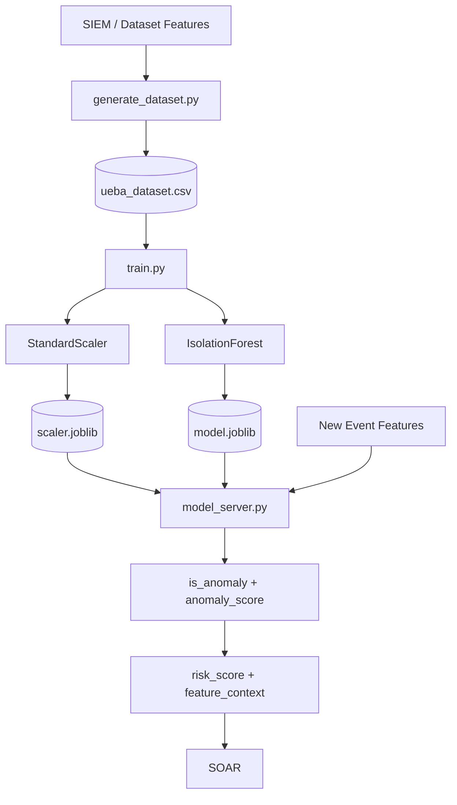
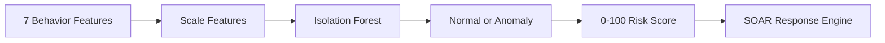

# UEBA Developer Simple Guide

## Who This Doc Is For

This doc is for the developer who worked on the UEBA module independently. It explains your module in simple words, what happens inside it, how it connects with SIEM and SOAR, and how to answer questions about anyone's part in the complete project.

## One-Line Explanation

The UEBA module is the behavior expert of ZenGuard: it looks at user/entity behavior features and decides whether the behavior is normal or suspicious.

## Simple Analogy

Imagine a college librarian who sees students every day.

Normally:

- Students enter during class hours.
- They use their own ID cards.
- They borrow a normal number of books.
- They use familiar devices and locations.

Suddenly one account:

- Enters at 2 AM.
- Uses an unknown device.
- Fails login many times.
- Tries to access restricted shelves.
- Stays connected for many hours.

Even if the librarian does not know the exact attack name, they can say:

"This behavior is unusual."

That is UEBA.

It does not just ask "Did a rule break?"
It asks "Does this behavior look different from normal?"

## What The UEBA Module Actually Does

The UEBA module does five main jobs:

1. Builds a behavior dataset from SIEM/dataset features.
2. Trains an Isolation Forest anomaly detection model.
3. Saves the trained model and scaler.
4. Runs live predictions through an API or local model class.
5. Converts anomaly output into a `risk_score` that SOAR can understand.

## Main Files You Should Know

| File | Simple Purpose |
| --- | --- |
| `Implemetations/UEBA/generate_dataset.py` | Creates `ueba_dataset.csv` from datasets and SIEM feature synthesis |
| `Implemetations/UEBA/train.py` | Trains Isolation Forest and saves model/scaler |
| `Implemetations/UEBA/model.joblib` | Saved ML model |
| `Implemetations/UEBA/scaler.joblib` | Saved scaler used before prediction |
| `Implemetations/UEBA/model.py` | Local Python class used by Streamlit integration |
| `Implemetations/UEBA/model_server.py` | FastAPI server for live UEBA/SOAR predictions |
| `Implemetations/UEBA/test_unit.py` | Offline model validation |
| `Implemetations/UEBA/test_integration.py` | Integration-style checks |
| `Implemetations/Integration/dashboard.py` | Dashboard that calls UEBA then SOAR |
| `dashboard_v2/simulator.py` | Live war-room demo using local UEBA scoring |

## The Seven Features UEBA Understands

UEBA does not read raw logs directly.

It reads seven clean behavior features:

| Feature | Simple Meaning |
| --- | --- |
| `failed_logins` | How many failed login attempts happened |
| `privilege_change_attempted` | Did the user try to get higher access |
| `external_connection` | Was the connection outside trusted network |
| `MFA_bypassed` | Was MFA bypassed |
| `session_duration` | How long the session lasted |
| `access_hour` | What hour the access happened |
| `device_trust_score` | How trusted the device is |

These seven features are like a health checkup report for user behavior.

## What Happens Inside UEBA, Step By Step

### Step 1: Dataset Is Generated

`generate_dataset.py` creates the UEBA dataset.

It reads dataset rows from the project `Datasets` folder.

For each row, it:

1. Finds the attack label.
2. Converts it into a common `attack_category`.
3. Calls SIEM's `synthesize_identity_features()` function.
4. Extracts the seven UEBA features.
5. Writes them into `ueba_dataset.csv`.

Simple analogy:

The raw dataset is like a long CCTV recording.
The generator converts it into a small behavior report for each person/session.

### Step 2: Features Are Scaled

The features have different ranges.

Example:

- `MFA_bypassed` is only 0 or 1.
- `session_duration` can be very large.
- `device_trust_score` is between 0 and 1.

If we directly feed these to ML, large numbers can dominate the model.

So `StandardScaler` converts them into a balanced scale.

Simple analogy:

Before comparing marks from different exams, convert them to the same scale.

### Step 3: Isolation Forest Is Trained

`train.py` trains an Isolation Forest model.

Isolation Forest is used because it is good at finding outliers.

Normal behavior usually forms a dense group.
Suspicious behavior usually sits away from the group.

Simple analogy:

If most students sit in the classroom and one person is standing on the roof, that person is an outlier.

Isolation Forest tries to find those outliers.

### Step 4: Model And Scaler Are Saved

After training:

- The model is saved as `model.joblib`.
- The scaler is saved as `scaler.joblib`.

This means the system does not need to train again every time it starts.

### Step 5: API Loads The Model

`model_server.py` starts a FastAPI server.

At startup, it loads:

- `model.joblib`
- `scaler.joblib`

Then it exposes endpoints.

### Step 6: UEBA Predicts Anomaly

When UEBA receives features:

1. It validates the input.
2. It arranges features in the same order used during training.
3. It scales the features.
4. It sends them to Isolation Forest.
5. The model returns:
   - normal or anomaly
   - raw anomaly score

### Step 7: UEBA Converts ML Score To Risk Score

Raw ML scores are not easy for SOAR to use.

Example:

```text
-0.63
```

SOAR needs something simple:

```text
0 to 100 risk score
```

So UEBA converts anomaly score into `risk_score`.

Risk meaning:

| Score | Meaning |
| --- | --- |
| 0-49 | Low risk |
| 50-74 | Medium risk |
| 75-94 | High risk |
| 95-100 | Critical risk |

### Step 8: UEBA Sends SOAR-Ready Output

The SOAR endpoint returns output like:

```json
{
  "risk_score": 100,
  "is_anomaly": true,
  "anomaly_score": -0.63,
  "feature_context": {
    "MFA_bypassed": 1,
    "privilege_change_attempted": 1
  },
  "soar_ready": true
}
```

This tells SOAR:

- how risky the event is
- whether it was an anomaly
- what important context caused risk

## UEBA Data Flow Diagram



## API Endpoints

### `GET /health`

Checks if the API is running and whether the model is loaded.

### `POST /api/ueba/predict`

This is the basic ML endpoint.

It returns:

- `is_anomaly`
- `anomaly_score`

### `POST /api/soar/evaluate`

This is the SOAR-friendly endpoint.

It returns:

- `risk_score`
- `is_anomaly`
- `anomaly_score`
- `feature_context`
- `soar_ready`

## How UEBA Connects With SIEM

SIEM gives UEBA clean features.

SIEM does not send raw logs like:

```text
Failed password for root from 45.33.1.10
```

Instead, SIEM gives structured behavior:

```json
{
  "failed_logins": 12,
  "privilege_change_attempted": 0,
  "external_connection": 1,
  "MFA_bypassed": 0,
  "session_duration": 0.1,
  "access_hour": 3,
  "device_trust_score": 0.1
}
```

That is what UEBA understands.

## How UEBA Connects With SOAR

SOAR does not understand Isolation Forest scores.

SOAR understands:

- risk score
- context
- whether response is needed

So UEBA acts as a translator:

```text
ML anomaly score -> security risk score -> SOAR action decision
```

## What You Should Say In Presentation

Use this simple explanation:

"My UEBA module takes the seven behavior features prepared by SIEM and checks whether the behavior is normal or abnormal. I trained an Isolation Forest model on those features. During live prediction, the model returns an anomaly score, but SOAR cannot directly use that score. So UEBA converts it into a 0-100 risk score and sends important context like MFA bypass and privilege attempt to SOAR."

## Questions You Should Be Able To Answer

### Why did we use UEBA?

Rules can catch known attacks, but behavior analytics can detect unusual patterns even when the exact attack rule is not known.

### Why Isolation Forest?

Because it is good for unsupervised anomaly detection. It can find outliers without needing perfect labeled examples of every attack.

### What does unsupervised mean here?

The model learns the structure of feature data without using labels as direct training targets. Labels are used mainly for checking performance after training.

### Why do we need StandardScaler?

Because features have different ranges. Scaling prevents large numeric fields like session duration from dominating small fields like MFA bypass.

### What is `model.joblib`?

It is the saved trained Isolation Forest model.

### What is `scaler.joblib`?

It is the saved scaler used to transform features in the same way during training and prediction.

### Why is `risk_score` needed?

Because SOAR needs a simple value from 0 to 100. A raw ML score like `-0.63` is not useful for playbook decisions.

### What happens if MFA is bypassed?

UEBA sends that context to SOAR. If MFA bypass happens with multiple failed logins, UEBA can force the risk score to 100.

### Does UEBA execute playbooks?

No. UEBA only scores behavior. SOAR executes playbooks.

### Does UEBA collect logs?

No. SIEM collects and normalizes logs. UEBA consumes the features.

### What is the difference between `/api/ueba/predict` and `/api/soar/evaluate`?

`/api/ueba/predict` is mainly for ML diagnosis.

`/api/soar/evaluate` gives SOAR-ready output with risk score and context.

## Important Code Behavior To Remember

### Feature Order Matters

The model expects the same feature order used during training:

```text
failed_logins
privilege_change_attempted
external_connection
MFA_bypassed
session_duration
access_hour
device_trust_score
```

If the order changes, predictions become unreliable.

### `access_time` vs `access_hour`

Some dashboard code uses `access_time` as an hour value.
The FastAPI server expects `access_hour`.

The meaning is the same for the model: hour of access.

### Context Override Exists

ML alone may sometimes give a moderate score.

But security policy says:

```text
MFA bypass + failed logins > 3 = critical
```

So UEBA forces risk score to 100 in that case.

## Common Mistakes To Avoid While Explaining

- Do not say UEBA reads raw auth logs directly.
- Do not say UEBA executes SOAR actions.
- Do not say Isolation Forest is supervised classification.
- Do not forget to mention feature scaling.
- Do not present raw anomaly score as the final security score.
- Do not confuse the SIEM rule score with the UEBA ML risk score.

## Your Module In One Diagram



## Final Simple Summary

The UEBA module is the brain that studies behavior. SIEM gives it clean behavioral features. UEBA scales those features, runs them through an Isolation Forest, decides whether the behavior is anomalous, converts the result into a 0-100 risk score, and passes that score plus context to SOAR.

